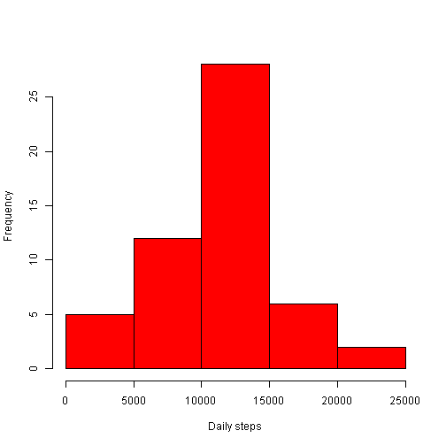
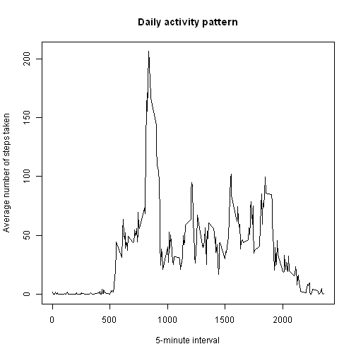
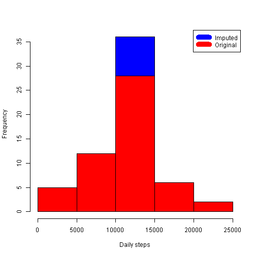
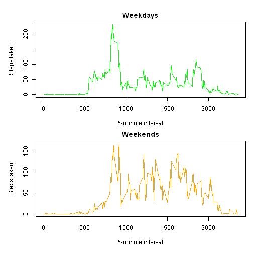

First, I will download, read, and transform the data as is necessary:  


```r
if(!file.exists("getdata-projectfiles-UCI HAR Dataset.zip")){
    temp <- tempfile()
    download.file("http://d396qusza40orc.cloudfront.net/repdata%2Fdata%2Factivity.zip", temp)   
    unzip(temp)
    unlink(temp)
}

dat <- read.csv("activity.csv")

str(dat)
```

```
## 'data.frame':	17568 obs. of  3 variables:
##  $ steps   : int  NA NA NA NA NA NA NA NA NA NA ...
##  $ date    : Factor w/ 61 levels "2012-10-01","2012-10-02",..: 1 1 1 1 1 1 1 1 1 1 ...
##  $ interval: int  0 5 10 15 20 25 30 35 40 45 ...
```

```r
## Change the classes of data to permit easier calculation.

dat$date <- as.Date(dat$date)
dat$steps <- as.numeric(dat$steps)
dat$interval <- as.numeric(dat$interval)
```

## What is the mean number of steps taken per day?  


```r
daily_steps <- aggregate(steps ~ date, data = dat, FUN = sum)

hist(daily_steps$steps, main = "", xlab = "Daily steps", col = "red")
```

 

```r
daily_mean <- mean(daily_steps$steps)
daily_median <- median(daily_steps$steps)
daily_mean
```

```
## [1] 10766.19
```

```r
daily_median
```

```
## [1] 10765
```

The mean number of steps taken per day is 10,766. The median number of steps taken per day is 10,765.

## What is the average daily activity pattern?  


```r
interval_steps <- aggregate(steps ~ interval, data = dat, FUN = mean, na.action=na.omit)

plot(interval_steps$interval, interval_steps$steps, type="l", xlab= "5-minute interval", ylab= "Average number of steps taken", main = "Daily activity pattern")
```

 

```r
interval_steps[which.max(interval_steps$steps), ]
```

```
##     interval    steps
## 104      835 206.1698
```
The five-minute interval with the greatest daily activity, on average accross all days in the dataset, is 835.

## Missing values


```r
length(which(is.na(dat$steps)))
```

```
## [1] 2304
```
There are 2,304 missing values. I will impute these with the mean value for the corresponding invterval accross all days.


```r
impute_dat <- transform(dat, steps = ifelse(is.na(dat$steps), interval_steps$steps[match(dat$interval, interval_steps$interval)], dat$steps))
```

Let's take a look at the new data with the missing values replaced.


```r
impute_daily_steps <- aggregate(steps ~ date, impute_dat, sum)

## Create a histogram of the new daily totals and add it to the original histogram.

hist(impute_daily_steps$steps, main = "", xlab = "Daily steps", col = "blue")
hist(daily_steps$steps, main = "", xlab = "Daily steps", col = "red", add = T)
legend("topright", c("Imputed", "Original"), col = c("blue", "red"), lwd=10)
```

 

```r
imputed_mean <- mean(impute_daily_steps$steps)
imputed_median <- median(impute_daily_steps$steps)

imputed_mean - daily_mean
```

```
## [1] 0
```

```r
imputed_median - daily_median
```

```
## [1] 1.188679
```

The mean steps per day with the imputed data is 10,766 steps. The median steps per day with the imputed data is also 10,766.  

The mean value with the imputed data is the exact same, while the median value is very similar (only about 1 step more daily).  

Imputing data introduced a large number of average values, which is reflected in the histograms central growth. The impact on estimates of total daily steps was negligible because imputing average values accross all intervals only serves to revert the total to the mean. The median for imputed values was slightly higher because median is a counting value rather than a mathematical calculation.  

## Are there differences in activity between weekdays and weekends?


```r
## Retrieve the type of day using the weekdays() function. Assign all days that are Saturday or Sunday to "weekend" and every other day to "weekday".
impute_dat$day <- as.factor(ifelse(weekdays(impute_dat$date) %in% c("Saturday", "Sunday"), "weekend", "weekday"))

## Create a panel plot comparing weekdays to weekends.
weekdays_dat <- impute_dat[which(impute_dat$day == "weekday"), ]
weekends_dat <- impute_dat[which(impute_dat$day == "weekend"), ]

weekdays_steps <- aggregate(steps ~ interval, data = weekdays_dat, FUN = mean, na.action=na.omit)
weekends_steps <- aggregate(steps ~ interval, data = weekends_dat, FUN = mean, na.action=na.omit)

par(mfrow = c(2,1),  mar = c(4, 4, 2, 1), oma = c(1, 1, 1, 0))
plot(weekdays_steps$interval, weekdays_steps$steps, type="l", xlab= "5-minute interval", ylab= "Steps taken", main = "Weekdays", col="green")
plot(weekends_steps$interval, weekends_steps$steps, type="l", xlab= "5-minute interval", ylab= "Steps taken", main = "Weekends", col="orange")
```

 


The average steps taken on weekends varies more across all five-minute intervals (throughout the day), whereas on weekdays the maxium is reached earlier and declines to a more constant number of steps (for the rest of the day.)
